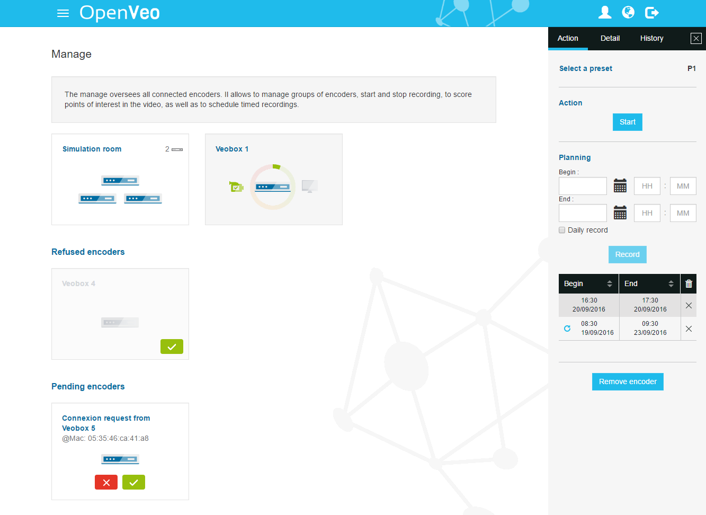
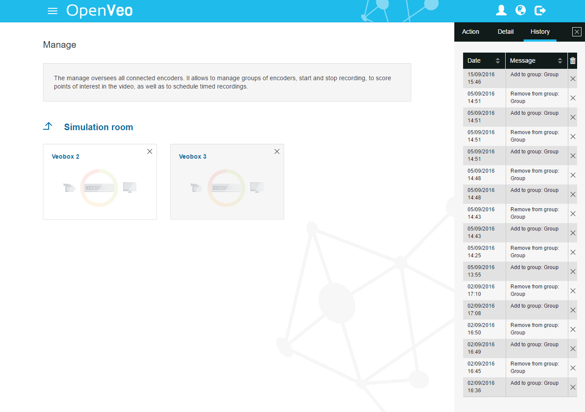

# What's OpenVeo Manage ?

OpenVeo Manage is an [OpenVeo](https://github.com/veo-labs/openveo-core) plugin.

OpenVeo Manage adds the following features :

- The possibility to manage encoders :
    - Create groups of encoders via drag-and-drop
    - Create/remove scheduled jobs for groups and encoders with the possibility to be recurrent
    - See the details of groups and encoders in a window like scheduled jobs, storage, history ...
    - An access to a page to visualize the devices of a group
    - Rename encoders and groups
    - Select a specific preset option for records
    - Start, tag and stop manually a record
    - Remove manually an history element
    - Remove an encoder

All data are synchronized in real-time in order to keep all users connected to the manage up to date.

## Screenshots

### Back end manage

### Back end manage group detail
